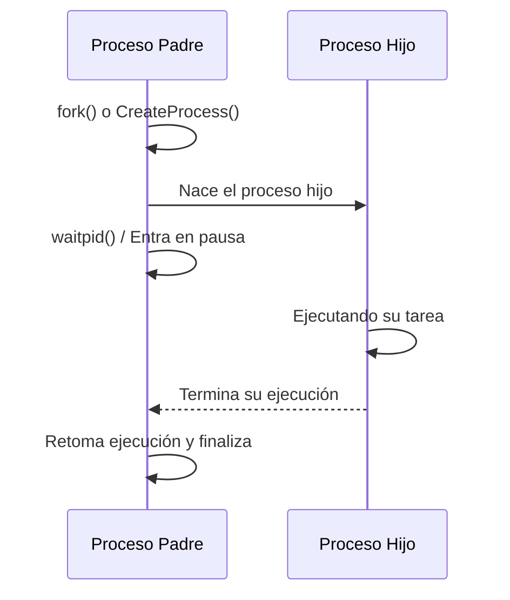
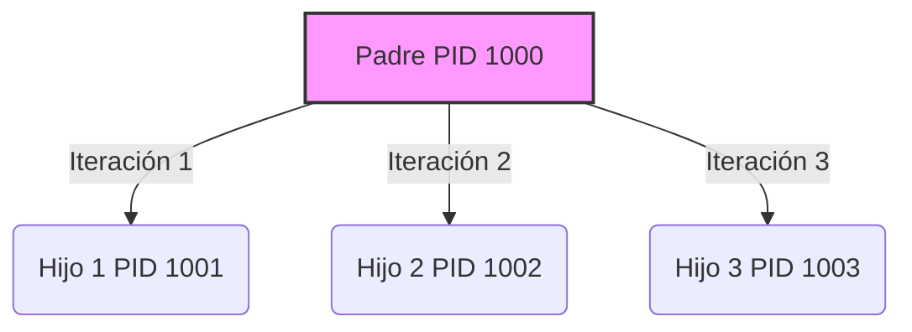
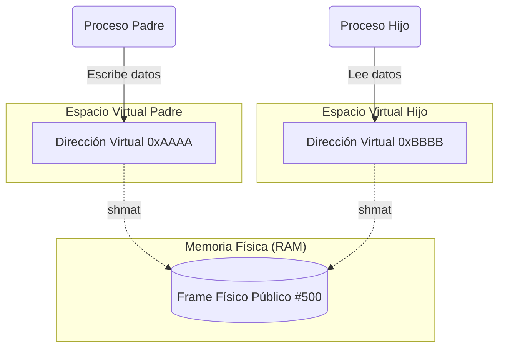

## Documentación: Creación y Manejo de Procesos

Conceptos Clave Investigados

- **Creación de Procesos:** Cuando ejecutamos algo, el sistema crea un proceso. En Linux, esto se hace usando llamadas al sistema como `fork()` y `exec()`. La función `fork()` clona el proceso actual para crear un nuevo "proceso hijo". Por otro lado, en Windows se utiliza la función CreateProcess() para iniciar un proceso nuevo, el cual se hace directamente sin clonaciones, ubica el espacio de memoria para dicho procesa y lo instancia directamente.

- **Identificadores (PID):** Para no perderse el sistema le asigna un número único a cada proceso llamado Process ID (PID). En Linux, se pueden usar comandos como `getpid()` para saber el ID del proceso que está corriendo y getppid() para saber el ID del proceso padre que lo creó. En Windows, se usa `GetProcessId()` para lograr esto.

- **Esperas y Tiempos:** A veces los procesos van muy rápido y se necesita pausarlos para ver en qué orden se ejecutan, para esto usamos la función sleep(). Además, usando ciclos, un mismo programa puede generar múltiples procesos hijos a la vez.

Links que usamos para investigar:
- [IPC through shared memory](https://www.geeksforgeeks.org/operating-systems/ipc-shared-memory/)
- [pipe() system call](https://www.geeksforgeeks.org/c/pipe-system-call/)
- [How to create a linux pipeline example in c](https://stackoverflow.com/questions/21923982/how-to-create-a-linux-pipeline-example-in-c)
- [waitpid()](https://www.qnx.com/developers/docs/8.0/com.qnx.doc.neutrino.lib_ref/topic/w/waitpid.html)
- [fork() in c](https://www.geeksforgeeks.org/c/fork-system-call/)

## Preguntas del documento (instrucciones de la práctica):

1. **Los pasos de creación de procesos**
El proceso de creación depende del sistema operativo en el que se trabaje. Si un usuario está en Linux, el programa llama a la función `fork()` para dividirse y crear un proceso hijo. A partir de ese momento, ambos procesos (padre e hijo) existen en el sistema al mismo tiempo. Si el usuario está en Windows, el programa hace una llamada a `CreateProcess()` para spawnear un proceso totalmente nuevo. En los dos casos, el sistema operativo le asigna espacio en memoria y un identificador único al nuevo proceso para poder administrarlo.

2. **Cómo funciona la sincronización** 
La sincronización sirve para poner orden, cuando un proceso padre crea a un hijo, muchas veces el padre no debe seguir avanzando o cerrarse hasta que el hijo termine su tarea. Para lograr esto, el proceso padre se queda "esperando". En Linux esto se hace utilizando la función `waitpid()`, y en Windows se usa `WaitForSingleObject()`. Hacer esta pausa es súper importante para que el sistema haga una limpieza adecuada y se evite dejar procesos "zombies" consumiendo recursos en la computadora.

3. **Cómo funcionan los mecanismos de IPC**
IPC significa Comunicación entre Procesos (Inter-Process Communication). Como los procesos suelen estar aislados por seguridad, necesitan mecanismos especiales para compartir información entre ellos. Hay dos formas principales que se exploramos en la práctica:

- Tuberías (Pipes): Funcionan como un canal de una sola vía. Se crea la tubería con `pipe()` en Linux o `CreatePipe()` en Windows. Un proceso (como el padre) escribe un mensaje en un extremo de la tubería, y el otro proceso (el hijo) lo lee por el otro extremo.

- Memoria Compartida: Este es un método más avanzado donde el sistema reserva un pedazo de memoria al que ambos procesos pueden acceder. En lugar de enviarse mensajes, el padre escribe datos directamente en esa memoria compartida usando funciones como `shmget()` y `shmat()` en Linux , o `CreateFileMapping()` en Windows , y el hijo simplemente lee los datos de ese mismo lugar

## Diagramas

### Creación de Procesos y Sincronización

### Comunicación unidireccional con Tuberías

### Generación de Múltiples Hijos

### Memoria Compartida y Page Tables

